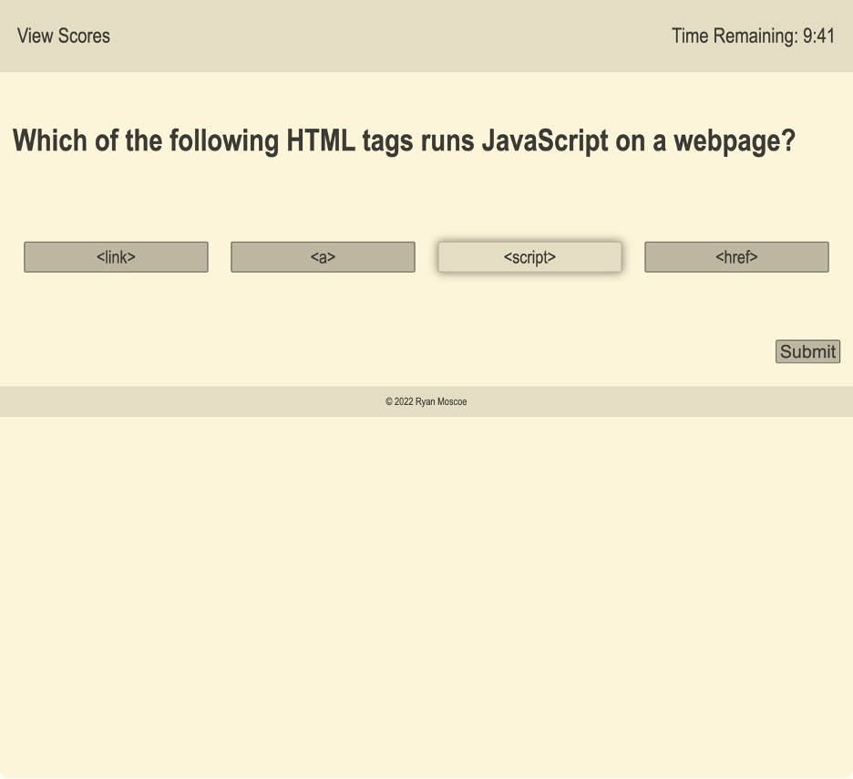

# Code Quiz

## Technology Used 

| Technology Used         | Resource URL           | 
| ------------- |:-------------:| 
| HTML    | [https://developer.mozilla.org/en-US/docs/Web/HTML](https://developer.mozilla.org/en-US/docs/Web/HTML) | 
| CSS     | [https://developer.mozilla.org/en-US/docs/Web/CSS](https://developer.mozilla.org/en-US/docs/Web/CSS)      |   
| JavaScript | [https://developer.mozilla.org/en-US/docs/Web/JavaScript](https://developer.mozilla.org/en-US/docs/Web/JavaScript) |
| Git | [https://git-scm.com/](https://git-scm.com/)     |    

</br>

## Description 

[Take the Quiz](https://rmoscoe.github.io/code-quiz-challenge/)

I've been creating e-learning courses for 13 years, but this is the first time I've coded a module from scratch, rather than using a rapid authoring tool. This quiz presents the user with ten questions about JavaScript in a random order. The quiz has a time limit of 10 minutes, and the user's score is the number of seconds remaining when all questions are answered or time runs out. Users can then save their score in local storage and view the five highest scores.

 Highlights of this application include
* Using an interval to track and display the remaining time
* Dynamically creating HTML elements for each question and the score display
* Storing and retrieving information in local storage
* Supporting both multiple choice (single-answer) and multi-select (multiple-answer) questions
* Responsively adjusting the layout and size of elements according to the size of the window

<br />


<br />

## Learning Points 


I learned a lot from this project!
* Intervals and timeouts
* Local storage
* Data- attributes

In addition, I honed existing knowledge about dynamically creating and inserting elements, as well as event handling.

<br />

## Code Examples

The focus for this project was JavaScript, so the HTML code is extremely light. Only a handful of elements exist when the page first loads:


```html
<main>
    <section id="welcome">
        <h1>JavaScript Quiz</h1>
        <p>When you are ready, click the Start Quiz button below to begin the quiz. You will have 10 minutes to answer 10 questions. For each incorrect answer, 20 seconds will be deducted from your remaining time. Your score will be the number of seconds remaining when you have answered all questions or when time runs out. Good luck!</p>
        <button id="start">Start Quiz</button>
    </section>
    <form id="save-score">
        <h2>Quiz Complete</h2>
        <p>Your final score is <span id="final-score"></span> seconds remaining. To save your score, enter your initials and click Submit.</p>
        <div id="input-row">
            <label for="initials">Initials:</label>
            <input type="text" id="initials" name="initials" maxlength = "3" required/>
            <input type="submit" id="submit-initials" />
        </div>    
    </form>
</main>
```

To dynamically insert the questions on the page, I used a Javascript Class and included the necessary HTML in the constructor function: 

```JavaScript
this.section.innerHTML = "<h3>" + this.question + "</h3> <div class='codeblock'><code>" + this.code + "</code></div><br /> <br /> <ul class = 'answers'><li class = 'answer-choice' data-correct = '" + this.answers[0].dataCorrect + "'>" + this.answers[0].text + "</li><li class = 'answer-choice' data-correct = '" + this.answers[1].dataCorrect + "'>" + this.answers[1].text + "</li><li class = 'answer-choice' data-correct = '" + this.answers[2].dataCorrect + "'>" + this.answers[2].text + "</li><li class = 'answer-choice' data-correct = '" + this.answers[3].dataCorrect + "'>" + this.answers[3].text + "</li></ul><br /> <button class = 'submit'>Submit</button>";

```

As a result, each question could be dynamically inserted with a single line of code within a function to select the next question at random: 

```javascript
mainSec.appendChild(newQuestion.section);
```

<br/>

## Usage 

When the user clicks the "Start Quiz" button, the timer begins to count down and a question is displayed at random, as shown below.

<br />



<br />

After each question is answered, an alert opens with feedback. If the answer was incorrect, 20 seconds are taken off the clock. When the quiz ends, the user is prompted to enter his/her initials in order to save his/her score:

<br />


<br />

High scores are displayed automatically after the user enters his/her initials, and the user can also view the scores at any time using the View Scores link:

<br />


<br />

## Author Info

### Ryan Moscoe 


* [Portfolio](https://rmoscoe.github.io/portfolio/)
* [LinkedIn](https://www.linkedin.com/in/ryan-moscoe-8652973/)
* [Github](https://github.com/rmoscoe)
<br/>

## License

See repository for license information.